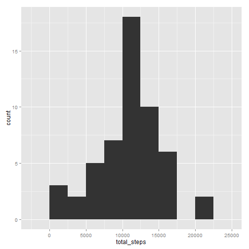
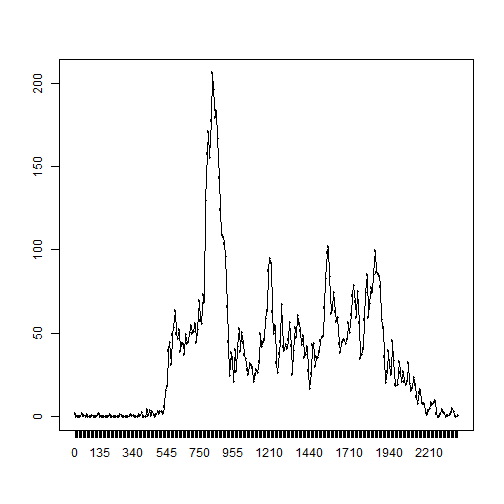
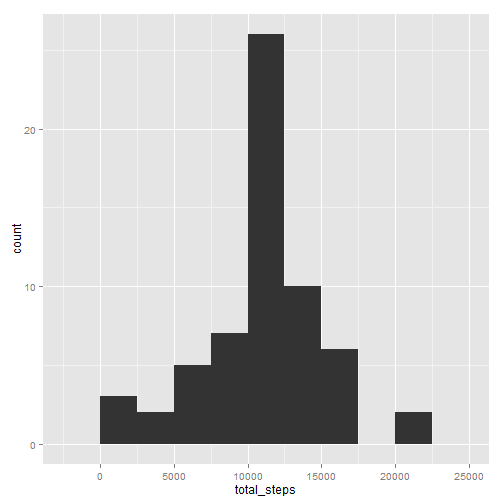
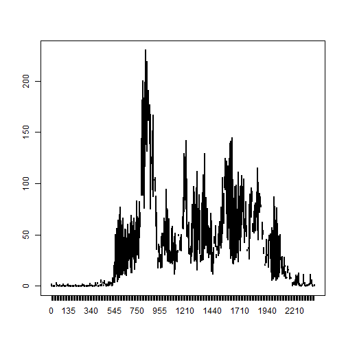
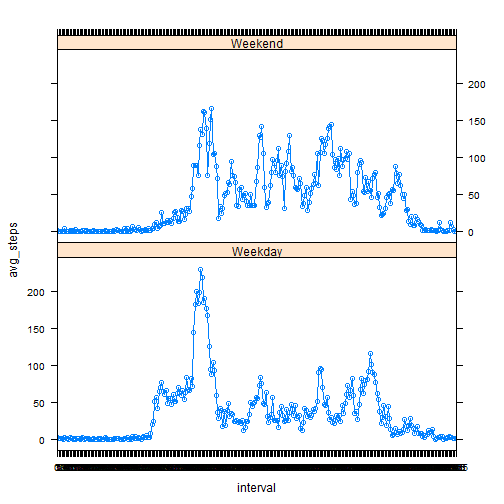

## Loading and preprocessing the data


```r
require(dplyr, quietly = TRUE)
require(ggplot2, quietly = TRUE)
```


```r
# check if csv file has already been unzipped, if not then unzip it
if(!file.exists("activity.csv")) {
        unzip(paste(dir_name, "activity.zip", sep = "/"))
}
# read the csv file and import into dataframe called activity
activity <- read.csv("activity.csv")
```

Now convert the interval variable to factor, and convert the date variable so that it's
actually stored as a date


```r
activity$interval <- factor(activity$interval)
activity$date <- as.Date(activity$date, format = "%Y-%m-%d")
```


## What is mean total number of steps taken per day?

Now we need to calulate the mean and median number of steps taken per day

### Create a data frame with total number of steps taken per day


```r
steps_per_day <- activity %>% group_by(date)
steps_per_day <- summarise(steps_per_day, total_steps = sum(steps))
qplot(total_steps, data = steps_per_day, geom = "histogram", binwidth = 2500)
```

 

### Calculate the mean and median of the steps per day, making sure to ignore NA values


```r
mean_steps_per_day <- round(mean(steps_per_day$total_steps, na.rm = TRUE), 2)
median_steps_per_day <- median(steps_per_day$total_steps, na.rm = TRUE)
```

So the mean steps per day is ```1.076619 &times; 10<sup>4</sup>``` and the median steps per
day is ```10765```.

## What is the average daily activity pattern?


```r
steps_per_interval <- group_by(activity, interval) %>% summarise(avg_steps = mean(steps, na.rm = TRUE))
plot(steps_per_interval$interval, steps_per_interval$avg_steps, type = "n")
lines(steps_per_interval$interval, steps_per_interval$avg_steps)
```

 

And the  5-minute interval containing maximum number of avg steps is ```835```.

## Imputing missing values

The total number of missing values in the dataset is ``2304```.

In order to fill in these missing step values we will take the mean for that interval across all the days (as we've already calculated this previously), and then apply that value.


```r
activity_incomplete <- activity[!complete.cases(activity), ]
activity_complete <- activity[complete.cases(activity), ]
n <- sum(is.na(activity$steps))
for(i in 1:n) {
        int <- activity_incomplete[i, 3]
        avg <- select(filter(steps_per_interval, interval == int), avg_steps)
        activity_incomplete[i, 1] <- avg
}
activity_filled <- rbind(activity_complete, activity_incomplete)
```

Now using this new caluclate data set with imputed values, let's calculate the histogram for the total number of steps per day again


```r
new_steps_per_day <- activity_filled %>% group_by(date)
new_steps_per_day <- summarise(new_steps_per_day, total_steps = sum(steps))
qplot(total_steps, data = new_steps_per_day, geom = "histogram", binwidth = 2500)
```

 

Calculate the mean and median of the steps per day, using these new imputed values


```r
new_mean_steps_per_day <- round(mean(new_steps_per_day$total_steps, na.rm = TRUE), 2)
new_median_steps_per_day <- median(new_steps_per_day$total_steps, na.rm = TRUE)
```

So the mean steps per day is now ```1.076619 &times; 10<sup>4</sup>``` and the median steps per
day is now```1.0766189 &times; 10<sup>4</sup>```.

Because we've used average values for these missing step values there is very little change to the calculate mean and media values.


## Are there differences in activity patterns between weekdays and weekends?

First add new column ````daytype```` to state whether the day is a weekday or a weekend


```r
activity_filled[weekdays(activity_filled$date) %in% c("Saturday", "Sunday"), 4] <- "Weekend"
names(activity_filled)[4] <- "daytype"
activity_filled[is.na(activity_filled$daytype), 4] <- "Weekday"
```

Now calculate the average for each interval and daytype and then plot these


```r
new_steps_per_interval <- group_by(activity_filled, interval, daytype) %>% summarise(avg_steps = mean(steps, na.rm = TRUE))
plot(new_steps_per_interval$interval, new_steps_per_interval$avg_steps, type = "n")
```

 

```r
xyplot(avg_steps ~ interval | daytype, new_steps_per_interval, type = "b", layout = c(1, 2))
```

 

